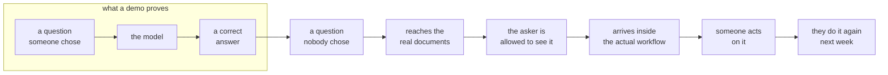

## One-line answer

A model that answers correctly in a demo has travelled almost the whole distance and arrived
nowhere, because the part that was skipped is the only part the business experiences.

## The story

You ordered something. The tracking page updates all week and every update is good news. Left the
warehouse. Cleared the sorting hub. **Arrived at your local delivery facility.**

That facility is two miles from your front door. The parcel has come six hundred miles and it is
two miles away.

Then nothing happens for four days.

When you finally get through to someone, the answer is not that the parcel is lost. They know
exactly where it is. It is on a shelf, in that building, two miles away, because the address has a
flat number the courier's handheld will not accept, and there is a door code nobody recorded, and
the one driver who knows the building is on a different round now.

Six hundred miles of the journey worked perfectly. You still have no parcel.

## The idea in plain language

Two words in that scene are worth separating, because the rest of this curriculum depends on the
difference.

**Distance travelled** is how much of the journey is done. Six hundred of six hundred and two
miles. Ninety-nine point seven per cent.

**Delivery** is whether the thing is in your hands. Zero per cent.

They are not the same measurement, and the second one does not care about the first. Nobody has
ever been consoled by how far their parcel got.

An AI system has exactly this shape. Building something that produces a correct answer on a
prepared question is the six hundred miles. It is real work and it is most of the visible effort.
And it is not delivery, because the business does not experience *a correct answer*. The business
experiences *a person doing their job differently on Monday morning*.

The gap between those two is what this curriculum calls **the last mile**, and it is where the
work of a forward deployed engineer lives.

Three terms, defined here because they get used loosely for the next 180 days:

- A **demo** is a system shown on inputs chosen by the person showing it. Choosing the inputs is
  not cheating — it is what a demo is for. It is dangerous only when the audience mistakes it for
  evidence about inputs nobody chose.
- **Production** is a system running against inputs nobody chose, at a volume nobody supervises,
  for people who did not build it and cannot be asked to be patient with it.
- **Adoption** is production plus one further thing: the people it was built for using it instead
  of the thing they used before.

Most AI work that fails does not fail at the model. It fails somewhere in the two miles between
the depot and the door — a document format nobody looked at, a permission nobody had, a workflow
the answer arrives too late to be part of, an answer that is correct but that no one is allowed to
act on without a signature the system never asked for.

The uncomfortable part: **that gap is not made of hard problems.** It is made of a hundred small
ones, none of which is interesting, all of which are load-bearing. A flat number the handheld will
not accept is not a research problem. It is still, exactly, why the parcel is on a shelf.

## Why Yantra needs it

Everything after Day 5 in this plan is built against one client, one corpus and one number, and
that constraint only makes sense if you accept the argument above.

The nearest place it becomes concrete is **Day 4**, where you audit five hundred real records
before promising anything, and find out what the documents are actually like rather than what the
sample set suggested. That day is a direct consequence of this one: it exists because the demo's
inputs were chosen and the production inputs will not be.

It comes back with money attached on **Day 167**, the day `yantra-platform` is deployed behind a
private endpoint and reported against the baseline set in Phase 1. On that day, "the retrieval
quality is good" is not an acceptable sentence. The only acceptable sentence names the number, the
population it was measured on, and the date. That habit starts here, or it does not start.

## The mechanism

The mechanism is a decomposition, so the useful form of it is a picture of where the effort
actually goes.

Here is the journey a request makes in a system that is genuinely in use. The shaded stretch is
the demo. Everything after it is the last mile.



Read left to right, the picture makes one claim: **the demo is a prefix.** It is not a small
version of the system. It is the first three boxes of nine, and the six that follow are not
refinements of the first three — they are different work, with different failure modes, owned by a
different person.

Now the same decomposition as a table, because the table is the one you will actually use when
someone asks you to scope a piece of work.

| Stage | What it asks | Who usually assumes it is handled |
| --- | --- | --- |
| A question nobody chose | Does it hold on inputs we did not pick? | the person who picked the inputs |
| Reaches the real documents | Are the real ones like the samples? | everyone, always |
| The asker is allowed to see it | Should *this* person see *this* answer? | the security team, later |
| Arrives inside the workflow | Is it where the work already happens? | the vendor's roadmap |
| Someone acts on it | Is acting on it permitted without a signature? | nobody |
| They do it again next week | Was it better than what they did before? | nobody, ever |

The right-hand column is the point. Every one of those stages has someone who believes it is
somebody else's problem, and the last two have nobody at all. **That vacancy is the job.**

## When it breaks

The failure this part is about does not produce a stack trace. It produces a sentence in a meeting,
and the sentence is always some version of this one:

```text
"It worked when we showed it to you in March."
```

That is the error text. It is worth taking as seriously as a traceback, because it carries the same
information a traceback does: it names the exact assumption that was violated, and it names it too
late to be cheap.

What it actually means, translated: *the inputs in March were chosen by us, the inputs in
September were chosen by the world, and nobody wrote down that this was the difference.*

The smallest fix is not technical and it is available on the first day of any engagement: **write
down, before building anything, which inputs were chosen and by whom.** A demo that says out loud
"these four documents were hand-picked and the scanned ones are not represented" is worth more than
one that quietly implies otherwise, and it costs one sentence.

You will build the honest version of this on Day 2, where the vendor chatbot in the client's own
history is taken apart. The client has already lived this failure. That is why they are sceptical,
and their scepticism is correct.

## In production

**What a professional does instead.** They do not demo on inputs they chose. They ask the client
for twenty inputs *the client* chooses, sight unseen, and they demo on those — including the ones
that fail, shown failing. This looks like a worse demo and wins more work, because the audience has
seen a system with a known edge rather than a system with an unknown one.

**What degrades under real traffic.** The last mile is where volume bites first. A step that a
person can do by hand for the ten items in a pilot becomes the bottleneck at ten thousand. On
Day 152 you will attribute cost per tenant and find that the expensive part of a request is rarely
the model call — it is the retries, the re-reads and the re-asks that the demo never had, because
the demo never had a user who phrased the question badly.

**The review comment.** On a design document that describes only the model, the senior comment is
some form of: *this describes the depot, not the doorstep — who does this reach, in what tool, and
what are they allowed to do with it?* If a design cannot answer that in two sentences, it is not
yet a design.

**The interview question.** *"Tell me about an AI project that worked technically and failed
anyway."* The answer they are listening for names a specific stage of the last mile — a permission
model, a workflow integration, an adoption problem — and does not blame the users. Anyone who has
delivered has this story. Anyone who has only built demos answers with a model quality problem,
which is the tell.

## Check yourself

**Run:**

```bash
git log --oneline -1
```

You should see day 0's single commit. That is the whole repository so far, and this part has added
nothing to it — today's first three parts are argument, and the artifact arrives in section 2.

**Say out loud, without scrolling up:** name the six stages that come *after* the model produces a
correct answer, and for each one, say who usually assumes somebody else is handling it. If you can
only name three, read the table again — the two you are most likely to miss are the last two, and
they are the two nobody owns.
