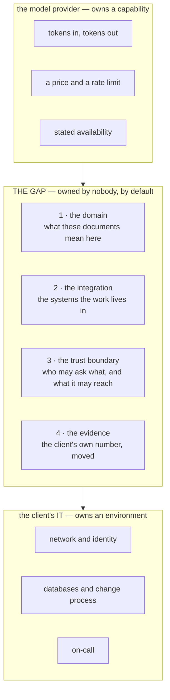

## One-line answer

Four responsibilities sit in the gap between the model provider's edge and the client IT
department's edge, and a forward deployed engineer is defined by owning all four rather than by
knowing any particular technology.

## The story

Back to the parcel on the shelf, and the phone calls it takes to get it moved.

You call the retailer. They are helpful and they are certain: the parcel left their warehouse on
Monday, here is the handover reference, it is with the carrier now. Their responsibility ended at a
loading bay.

You call the carrier's national number. Also helpful, also certain: it is at the local facility,
scanned in, nothing outstanding at their end. Their responsibility ended when the parcel reached
the right building.

Both of them are telling the truth. Neither of them is lying about their part. And there is no
number to call for the two miles in between, because those two miles are not any one company's
job — they are the place where the retailer's job has finished and the carrier's national job has
finished and the thing that has to happen next is somebody walking up to a door with a code nobody
wrote down.

The parcel is not stuck because someone failed. It is stuck because of a gap between two people who
both succeeded.

## The idea in plain language

The same two-sided gap exists in every AI project inside an organisation, and it exists for the same
structural reason: two competent parties each finish at a boundary, and the boundaries do not meet.

**On one side, the model provider.** They own a capability: text in, text out, at a price, with a
rate limit and a stated availability. Their responsibility ends at their API's edge. They will
never know what your documents look like, who is allowed to read them, or what your business does
on a Tuesday. This is not a criticism — a general capability cannot know those things and remain
general.

**On the other side, the client's IT department.** They own the environment: the network, the
identity system, the databases, the change process, the on-call rota. Their responsibility ends at
things they already run. They are not equipped to evaluate whether a retrieval pipeline is
returning the right clauses, and it is unreasonable to expect them to be.

Between those two edges sits a gap, and it contains four things. Every one of them is essential,
and none of them is anybody's job by default.

1. **The domain.** What the documents actually are, what the words in them mean here, which of the
   client's edge cases are common and which are folklore. A general model does not have this and
   the IT department is not asked for it.
2. **The integration.** Getting to the systems the work already lives in — the claims database, the
   file drop, the ticketing board — and getting the answer back into the place where a decision is
   made rather than into a separate screen nobody opens.
3. **The trust boundary.** Who is allowed to ask what, what the system may reach, what it must
   never return, and what happens when someone tries. The provider cannot know this; IT can enforce
   a policy but cannot write one for a capability they have not evaluated.
4. **The evidence.** Whether the thing is actually working, measured against a number that existed
   before you arrived. Not a benchmark score — the client's own number.

**The role is defined by that list, not by a stack.** This is the part that surprises people. A
forward deployed engineer is not "an ML engineer who travels". The defining property is
*ownership of a gap that has no owner*, and the skills follow from the gap rather than the other
way round.

Which is also why this curriculum looks the way it does. Those four responsibilities are why there
are days on legacy integration, on identity, on guardrails and on evaluation — not because they are
adjacent interests, but because each one is a quarter of the actual job.

## Why Yantra needs it

This part is the reason the plan's track list has thirteen entries instead of five.

The four responsibilities map onto the tracks almost exactly, and you can check this against
plan §6 right now: the domain is `FDE` and the data days; the integration is `ENT` — Days 133 to
138, the SOAP endpoint and the ticketing board and the file drop; the trust boundary is `SEC` and
`ENT`'s identity half — Days 139 to 149; the evidence is `OPS`, Days 150 to 160.

The nearest concrete consequence is **Day 133**, where the first task is an integration inventory:
finding out what the client actually runs rather than what they say they run. That day exists
because responsibility two has no other owner. If it were IT's job, the inventory would already
exist and be correct — and the reason the day is written around discovering that it is neither is
that this is what happens every time.

## The mechanism

The gap, drawn. Two parties, two edges, and the four things that fall between them.



Now the same four, as the questions that reveal whether each one is actually owned. These are worth
memorising, because you will ask them in a first meeting and the answers are diagnostic.

| # | The responsibility | The question that reveals whether anyone owns it | The answer that means "nobody" |
| --- | --- | --- | --- |
| 1 | The domain | *Who decides whether an answer is correct?* | "The business will know it when they see it." |
| 2 | The integration | *Where does the answer have to arrive for someone to act on it?* | "We'll start with a separate portal." |
| 3 | The trust boundary | *Which of these documents may a regional adjuster not see?* | "They're all internal." |
| 4 | The evidence | *What is the number today, before we start?* | "We don't measure that yet." |

Every answer in the right-hand column is good news, not bad. An unowned responsibility that has
been *named* is a scope item. An unowned responsibility that has not been named is the reason the
project is late, and nobody will be able to say why.

## When it breaks

The characteristic failure here is a project that runs for months with all four gaps open, and it
announces itself in a status meeting like this:

```text
Vendor:     the API is up, latency is within SLA, no errors on our side.
Client IT:  the network path is fine, the service is healthy, no tickets open.
Business:   nobody in the claims team is using it.
```

Three true statements and a dead project. Notice there is no error anywhere. Every monitored thing
is green, because everything anyone thought to monitor sits on one side or the other of the gap,
and the gap is not instrumented because it is not owned.

What it actually means: responsibility four was never taken, so there is no number that could have
gone red earlier. The failure was not detected late — it was undetectable, which is worse and is a
design flaw rather than an accident.

The smallest fix is the one this whole phase is about, and it happens before any code: name the
four owners in writing, in the engagement brief, on the first day. Where the answer is "nobody",
write *nobody*. An engagement brief with the word "nobody" in it three times is not a bad brief; it
is a brief that has found the actual work.

## In production

**What a professional does instead.** They refuse to scope work that leaves responsibility three or
four unowned, and they say so plainly rather than absorbing it silently. Absorbing it quietly is the
common mistake — you end up accountable for a trust boundary you were never given the authority to
enforce, which is how an engineer ends up personally deciding what a regional office may read.

**What degrades at scale.** Responsibility one, the domain, is the one that decays. The other three
are structural and hold once built; domain knowledge goes stale as the client's products, forms and
regulations change. On Day 111 you will meet the version of this that has a name — the relationship
in the graph that went stale in silence — and the reason it is taught as a maintenance problem
rather than a modelling one is this part.

**The review comment.** On an architecture that shows only the model and the client's systems, the
comment is: *there is no box here for the four things in between — who owns each of them, and where
is that written down?*

**The interview question.** *"What does a forward deployed engineer do that a good backend engineer
doesn't?"* A weak answer lists technologies. A strong answer is this part: the backend engineer
owns a system, and the forward deployed engineer owns a gap between two organisations, which means
the first artifact is a written agreement about ownership rather than a service.

## Check yourself

**Run:**

```bash
python granth.py brief 2
```

It should refuse, non-zero, because day 1 has no `PROGRESS.md` row yet. That refusal is the
ordering guard from day 0 part 3.2 doing its job, and it is worth seeing once from the far side:
the four responsibilities above are exactly the kind of thing a curriculum skips when it is allowed
to jump ahead to the interesting technology.

**Say out loud, without scrolling up:** name the four things in the gap, and for each one, name the
question you would ask in a first meeting to find out whether anybody owns it. Then answer this: of
the four, which one is the client most likely to believe is already handled?
