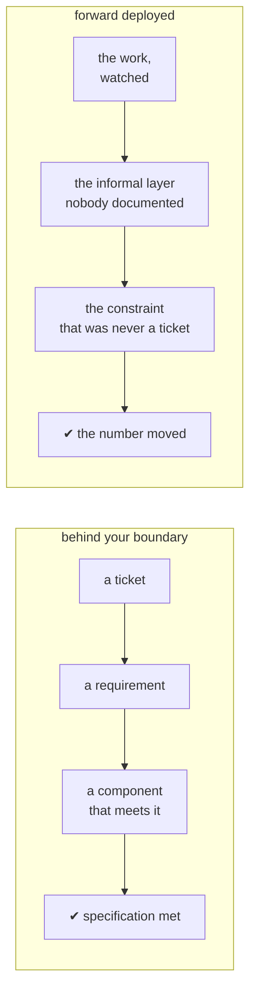

## One-line answer

*Forward deployed* is a position, not a job title: you sit inside the client's problem rather than
behind your own product's boundary, which changes what you are allowed to see, what you are
accountable for, and which failures you are permitted to call somebody else's.

## The story

Two couriers, same building, same week.

The first one has the standard round. He arrives, the handheld will not take the flat number, there
is no answer on the intercom, so he does what the process says: photographs the door, marks it
*attempted*, leaves a card, drives on. He has done his job correctly. Every step he took was the
right step.

The second one has been covering this postcode for two years. She knows the intercom panel has been
broken since the spring and that the way in is the side door, which the caretaker props open between
seven and nine. She knows flat 4B is really the second floor because the numbering skips a floor
after the conversion. She does not photograph the door. She delivers the parcel.

Same company, same handheld, same parcel. The difference is not effort and it is not skill in any
sense the training manual measures. It is **which side of the problem she is standing on.** The
first courier is standing at the edge of his process, looking at a building. The second is standing
inside the building's actual arrangements, which are undocumented, slightly irrational, and true.

## The idea in plain language

**Forward deployed** means your working position is inside the client's context rather than behind
your own boundary. The phrase is borrowed from a military sense of *stationed where the work is*,
and the borrowed part that matters is that it describes a location, not a rank.

Three things change when you move to that side of the table, and they are the whole of the idea.

**One: what you are allowed to see changes.** From behind a product boundary you see tickets,
requirements and requests. From inside, you see the work — the spreadsheet somebody maintains
privately because the real system cannot do the thing, the step everyone skips, the queue that is
triaged differently in one office. That informal layer is invisible from outside and is usually
where the actual process lives. Day 3's method of shadowing exists to reach it.

**Two: what you are accountable for changes.** Behind a boundary, you are accountable for your
component behaving as specified. Forward deployed, you are accountable for the outcome, which
includes components you do not control. That is uncomfortable and it is the point — accountability
for an outcome is the only arrangement under which the four responsibilities from
[part 1.2](1.2-the-four-things-nobody-else-owns.md) get owned at all.

**Three: which failures you may disown changes.** The first courier is entitled to say *the address
was bad*. That is a legitimate answer and it closes his ticket. Forward deployed, "the address was
bad" is not available to you, because the address being bad is the job. The equivalents you will
hear yourself wanting to say, and must not:

- *The data was messy.* The data is always messy. Day 4 exists because of it.
- *The users didn't adopt it.* Adoption is a design property, not a user failing. Day 178 is about
  the version of this that is actually somebody else's fault, and it is much narrower than it feels.
- *That's a security decision, not mine.* Responsibility three. If it is unowned, it is yours until
  somebody signs for it.

**What this is not.** Forward deployed does not mean saying yes to everything, and it does not mean
becoming a client employee. The counterweight is scope, in writing, and that is what Day 5 is for.
Ownership without a written boundary is not commitment; it is how an engagement becomes unbounded
and the engineer becomes the only person who knows how anything works.

## Why Yantra needs it

This part is why the plan fixes one client on Day 3 and never lets go of it, rather than exercising
each technique on whatever dataset suits it best.

It becomes concrete on **Day 4**, where you pull five hundred records and find out what they are
actually like. That day is only possible from inside — from outside you get the sample set, which
is the tidy one. The whole of Phase 17, the scanned and rotated and merged-cell pages on
Days 112 to 115, exists because of what Day 4 finds, and Day 4 is only findable from this side of
the table.

It comes back at the end, on **Day 175**, when an evaluation score blocks a pull request. A gate
that blocks your own work is only tolerable to someone who has accepted accountability for the
outcome rather than for the component. Anyone still standing behind a boundary will build that gate
with an override, and an override is exactly what a gate is not.

## The mechanism

The two positions, and what each one can reach.



The two chains end in different places, and that is the entire distinction: `specification met` and
`the number moved` are different claims, and only the second one is a delivery.

Here is the same contrast as the thing you will actually notice in a meeting — the sentence, and
what it costs you.

| Behind the boundary | Forward deployed | What the second one costs |
| --- | --- | --- |
| "That's out of scope." | "That's out of scope, and here is what it will take." | You have to know what it will take. |
| "The requirement said X." | "The requirement said X, and watching the work, X is not what happens." | You have to have watched the work. |
| "That's an IT decision." | "That's an IT decision — who signs it, and by when?" | You now own chasing it. |
| "The model is performing well." | "The number moved from 7.5 to 4.1 on motor claims." | You need a baseline, which means Day 3. |

Every row in the middle column is more work than the row on its left. That is not incidental — the
role exists precisely because somebody has to absorb that difference, and it is why the role is
paid as a senior one.

## When it breaks

The failure mode of this position is not doing it badly. It is doing it without a written scope,
and it looks like this — a real message, of a kind that arrives in month three of an unbounded
engagement:

```text
Since you're already in the claims system, could you also take a look at why the
overnight export to the reinsurance broker keeps dropping rows? Nobody else here
really understands that script.
```

That is what unbounded ownership feels like from the inside: reasonable, flattering, adjacent, and
completely outside anything anyone agreed to. It is not a hostile request. The person asking has
correctly identified that you are the only one standing in the gap.

What it actually means: the engagement has no written exit condition, so every adjacent problem is
now in scope by default. Nothing stops this on its own, because each individual request is small.

The smallest fix is a sentence written on Day 5 and quoted back cheerfully: the SOW's exit
condition. Not a refusal — a boundary that was agreed when everyone was calm, which is the only
time boundaries can be agreed. Part 3.1 of today writes the first draft of it.

## In production

**What a professional does instead.** They spend the first days of an engagement watching rather
than building, and they say so in the proposal so that it is a deliverable rather than a delay.
"Days 1 to 5 produce a written process map and a baselined number, not code" is a line that has to
survive the client's impatience, and it survives it best when it was priced.

**What degrades under pressure.** This position degrades in exactly one direction: towards becoming
the only person who understands the system. It feels like value and it is a liability — for the
client, who now has a dependency, and for you, because you cannot leave. Days 174 to 175, the
runbooks and the handoff, are the structural fix, and they are placed at the end of the plan
because that is when the temptation is strongest.

**The review comment.** On a proposal with no discovery phase, the comment is: *what number are we
moving, whose number is it, and what is it today?* If the proposal cannot answer, the discovery
phase was not cut — it was deferred to the middle of the build, where it costs ten times as much.

**The interview question.** *"A client asks you to do something outside the statement of work. What
do you do?"* The answer they are testing for is not "say no" and is not "do it". It is: name the
cost, name what it displaces, and get the trade decided by the person who owns the budget rather
than absorbed by the person who owns the keyboard.

## Check yourself

**Run:**

```bash
git status --short
```

Expect a clean tree, or only the day-1 folder you are reading. Nothing has been built yet today,
and that is correct: the first three parts of this day are the argument that decides what gets
built at all, and the artifact starts in the next section.

**Say out loud, without scrolling up:** name the three things that change when you move to the
client's side of the table. Then name the sentence you are no longer allowed to say, and what has
to exist in writing so that giving it up does not make the engagement unbounded.
