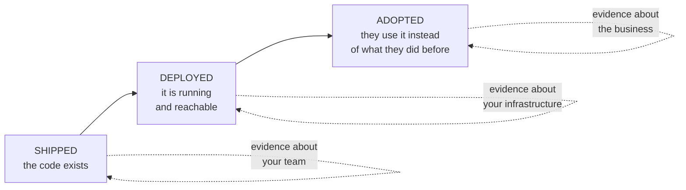

## One-line answer

*Deployed* is a fact about your infrastructure and *adopted* is a fact about someone else's
behaviour, and only the second one is evidence that the work happened.

## The story

The parcel arrives. Sort of.

The tracking page flips to **Delivered**, with a timestamp and a photograph. The photograph shows a
doorstep. It is a doorstep. It is not obviously your doorstep, but it is a doorstep, and the system
that took the photograph is satisfied.

The parcel is behind the bin store, under a tarpaulin, at a building where the bins are emptied on
Wednesday.

Here is what is worth noticing: **every measurement in that story is green.** Scanned out of the
depot, geolocation inside the delivery zone, proof-of-delivery photograph captured, status
Delivered, driver's round completed on schedule. The carrier's dashboard shows a successful
delivery, because every single thing the carrier decided to measure did in fact happen.

The one thing nobody measured is whether a person now has the thing they ordered.

## The idea in plain language

There are three finish lines, and organisations routinely celebrate the first one while believing
they have crossed the third.

**Shipped.** The code is written and merged. The system exists somewhere.

**Deployed.** It is running in the environment where real requests can reach it. It has a URL, it
returns 200s, it has a dashboard, and — this is the trap — **the dashboard will look identical
whether or not anybody is using it.** An endpoint serving zero requests is a perfectly healthy
endpoint. Latency is excellent. Error rate is zero.

**Adopted.** The people it was built for are using it instead of what they used before, and would
complain if it were taken away.

The distance between deployed and adopted is where AI projects die, and they die quietly, because
deployment produces artifacts that feel like completion. There is a URL. There is a dashboard.
There was a launch email. Every one of those is a measurement of *your* activity, and none of them
is a measurement of anyone else's.

**Why AI systems are unusually exposed to this.** A conventional feature usually sits in a path
someone is already walking — the button appears in a screen they already open. An AI capability
usually arrives as a *new* thing to go to, and asks a person to change what they do. That is a much
higher bar, and it is a bar that no amount of model quality clears on its own. An answer that is
correct, arriving in a tool nobody opens, is worth exactly as much as a parcel behind the bin
store.

The definition of done that this curriculum uses, and it is the one that makes Phase 1 necessary:

> The work is done when a number the client already tracked has moved, and stayed moved, without
> you in the room.

Three clauses, all load-bearing. *A number the client already tracked* rules out a metric you
invented, which is unfalsifiable. *Stayed moved* rules out the launch-week spike. *Without you in
the room* rules out the system that only works while its author is available on chat.

## Why Yantra needs it

This is the definition that Phase 1's gate enforces and that the last phase of the plan is built to
prove.

The nearest place it bites is **Day 3**, where "make claims processing faster" has to become a
number with an owner. That day is unwriteable without this part, because the reason a baselined
number matters is precisely that *deployed* cannot be distinguished from *adopted* without one.

It closes the loop on **Day 179**, the ROI presentation, and on **Day 181**, the defence. Both are
scored against the Day 3 baseline. If the number was never taken, those two days have nothing to
say and the entire delivery reduces to a demonstration — which is where this day started, in
[part 1.1](../01-the-last-mile/1.1-the-parcel-that-reached-the-depot.md).

The unglamorous version shows up on **Day 154**, where online evals catch the regression that
shipped anyway. Online evals are, precisely, the instrument that measures the third finish line
rather than the second.

## The mechanism

The three finish lines, and what each one is actually evidence of.



The dashed labels are the whole diagram. Three finish lines, three different subjects, and only the
third one has the business as its subject.

Now the part that makes this operational rather than a slogan — the signals, and which finish line
each one actually measures. This table is worth arguing with, because the left column is what most
status reports contain.

| Signal you might report | What it is evidence of | Finish line |
| --- | --- | --- |
| Test coverage, merged pull requests | your team's activity | shipped |
| Uptime, p99 latency, error rate | your infrastructure | deployed |
| Requests served | someone called it — possibly your own smoke test | deployed |
| Distinct human users, week over week | people chose to use it | adopted |
| Requests per user per week, holding steady | it became part of the work | adopted |
| The client's own operational number, moved | the business changed | adopted |

The middle three rows are where the confusion lives. **Requests served is not an adoption metric**
and it is the one most often presented as one. A smoke test running every minute produces forty
thousand requests a month, and there is no line on the dashboard that distinguishes those from
people.

The rule that follows, and it is cheap to apply: **every adoption metric has a human being as its
subject.** If you can satisfy a metric with a cron job, it is a deployment metric wearing an
adoption metric's clothes.

## When it breaks

This failure does not announce itself with an error. It announces itself with a dashboard, and the
dashboard is green. Here is one, from a service that nobody uses:

```text
service: claims-assistant          window: last 7 days
─────────────────────────────────────────────────────
availability            100.0%
requests                 10,081
p99 latency               412ms
error rate                 0.00%
─────────────────────────────────────────────────────
```

Perfect numbers, and they describe a dead service. Ten thousand requests over seven days is one
request every minute, exactly, which is the signature of a health check rather than a person —
people are bursty, and they do not work at three in the morning.

What it actually means: every instrument here has the service as its subject, so the service can
report perfect health while the thing it exists for is not happening. The dashboard is not lying.
It was asked the wrong question, and it answered that one accurately.

The smallest fix is one line on the same dashboard: **distinct human users this week, and the same
number last week.** If it is not there, add it before you add anything else. When it is there, the
service above reads: `distinct users: 0`, which is the only number on the panel that would have
told anyone anything.

You will build the real version of this on Day 152, where cost is attributed per user and per
tenant. Attribution turns out to be the same mechanism as adoption measurement — both require
knowing *who*, and a system that cannot say who is asking cannot say whether anyone is.

## In production

**What a professional does instead.** They agree the adoption metric *before* the build and put it
on the same dashboard as the health metrics, so that a green service with no users is visibly
absurd rather than quietly acceptable. Adding it afterwards is much harder politically, because by
then it looks like an accusation.

**What degrades over time.** Adoption decays, and it decays without any technical change. A
regulation changes, a form is redesigned, a team reorganises, and the assistant that fitted the
workflow no longer fits it. Nothing in the system breaks. The usage line bends down over six weeks
and no alert fires, because nobody alerts on a metric going *quiet*. On Day 154 you build the
online eval that catches this; the alert that matters is on the human number, not the error rate.

**The review comment.** On a launch plan whose success criteria are uptime and latency: *these are
all about us — which line on this dashboard is about them, and what does it read today?*

**The interview question.** *"How do you know if an AI feature you shipped was successful?"* The
tell is whether the answer contains a human being. Answers about accuracy, latency and uptime
describe the second finish line. The answer they are listening for names a behaviour that changed
and the number that showed it, and — the senior version — names how long after launch it was still
true.

## Check yourself

**Run:**

```bash
grep -rn "requests" docs/00_MASTER_PLAN.md | head -5
```

Read what comes back. Every hit is about a *budget* — requests you will spend, per provider, per
minute. Not one of them is a success metric, and that is deliberate: the plan counts requests as a
cost and never as evidence.

**Say out loud, without scrolling up:** name the three finish lines, and for each one, name whose
behaviour it is evidence about. Then state the test that separates an adoption metric from a
deployment metric dressed as one.
