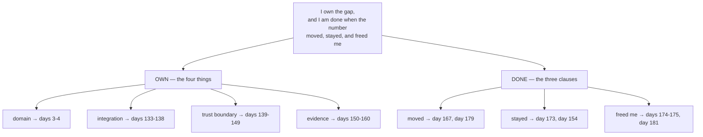

## One-line answer

The two halves of today join into one sentence — *I own the gap, and I am done when a number the
client already tracked has moved and stayed moved without me* — and that sentence is the contract
every later day in this plan is written against.

## The story

The parcel finally arrives, and there is a moment at the door that the whole delivery was for.

Not the handover. The signature.

Before it, the parcel is the carrier's problem — mis-sorted, delayed, undeliverable, still theirs.
After it, it is yours. Nothing physical changes at that moment; the box was already in your hands
a second earlier. What changes is that somebody has taken responsibility for a specific thing, at a
specific time, in a way that can be checked afterwards.

The signature is not a formality attached to the delivery. **It is the only part of the delivery
that makes the six hundred miles mean anything**, because it is the only part that says the journey
ended somewhere specific rather than merely stopping.

## The idea in plain language

Today had two halves, and they are the same idea seen from two sides.

[Section 1](../01-the-last-mile/1.1-the-parcel-that-reached-the-depot.md) said what you own: the
gap between the model provider's edge and the client IT department's edge — the domain, the
integration, the trust boundary, the evidence. Four things that are nobody's job by default.

[Section 2](../02-the-definition-of-done/2.1-deployed-is-not-adopted.md) said when you are finished:
not when it is shipped, not when it is deployed, but when a number the client already tracked has
moved and stayed moved without you in the room.

Joined, they are one sentence, and it is the one worth being able to say cold:

> **I own the four things nobody else owns, and I am finished when a number the client already
> tracked has moved, stayed moved, and no longer needs me.**

Three properties of that sentence are worth naming, because they are what make it a contract rather
than a motto.

**It is falsifiable.** There is a state of the world in which it is definitely not met: the number
did not move, or it moved and slid back, or it holds only while you are answering messages. That is
the test from [part 2.2](../02-the-definition-of-done/2.2-the-number-that-decides.md) applied to
your own role instead of to a metric.

**It is bounded.** *Four things*, not everything. This is the counterweight from
[part 1.3](../01-the-last-mile/1.3-the-other-side-of-the-table.md): the sentence commits you to a
gap, not to a client. The overnight export that keeps dropping rows is outside it, and being able
to say why in one line — without a fight, and without absorbing it — is the practical value of
having written the boundary down while everyone was calm.

**It ends.** *No longer needs me* is the clause people leave off, and it inverts what looks like
success. Being indispensable is the failure mode, not the reward. Days 174 and 175 — the runbooks
and the handoff — exist to make this clause achievable, and they are at the end of the plan because
that is when giving the system away feels most like giving something up.

## Why Yantra needs it

This sentence is the plan's spine, and you can check that claim directly against the phase gates in
plan §16 rather than taking it on trust.

**Day 5** turns it into a signed SOW with an exit condition — the sentence, made contractual.
**Day 167** reports `yantra-platform` against the Day 3 baseline, which is the "has moved" clause
with a deployed system behind it. **Day 173** reports the multi-agent pilot gate honestly, including
the week the number is bad, which is the clause surviving contact with a result nobody wanted.
**Day 179** is the ROI presentation: the number, translated into money, against the baseline.
**Day 181** is the last clause and the hardest — a stranger clones the repository and reaches a
working system without asking you anything. That is *no longer needs me*, made testable.

Every one of those days is this sentence with more machinery behind it. It is also why Phase 1 sits
in front of Phases 2 through 7 — you cannot decide which of forty days of Python, cloud and
containers is load-bearing without knowing what you are accountable for at the end of them.

## The mechanism

The two halves and where each clause is discharged. This is the map of the plan, read from today.



Seven branches, seven addresses. Nothing in the sentence is aspirational: every clause has a day
where it is either true or it is not.

And here is the sentence in the form you will actually need it — the four questions it answers when
someone asks what you do, and the answer that fails each one.

| Asked | The answer this sentence gives | The answer that fails |
| --- | --- | --- |
| What do you do? | I own the four things between the provider and the client's IT | I build AI systems |
| When are you finished? | When their number has moved and held without me | When it's deployed |
| How do we know it worked? | Against the baseline we took before starting | The users say they like it |
| What is out of scope? | Everything not in the four; here it is in writing | We'll see how it goes |

The right-hand column is not a set of bad answers by unserious people. Every one of them is what a
competent engineer says when nobody has made them write the sentence down. That is the whole reason
the first five days of this plan are not code.

## When it breaks

The sentence breaks in one direction far more often than the other, and it breaks quietly. Here is
what it looks like in a status update in month five:

```text
Week 19 update

  - Added the reinsurance export fix (thanks for flagging)
  - Investigated the duplicate-claims report for the Leeds team
  - Onboarded two new users to the assistant
  - Baseline measurement: still pending, will pick up once things calm down

  Next week: the Oracle connector, and the export again if it recurs
```

Nothing in that update is idle. Four useful things happened. And the engagement has failed, because
the one line that carries the contract — the baseline — is the line that has been deferred for
nineteen weeks, and by now it cannot be taken at all: the process has already changed under the
work that was done.

What it actually means: the *own* half of the sentence expanded to fill the available time, and the
*done* half was never anchored. Both failures are the same failure — the boundary was not written
down on day one, so ownership had no edge and completion had no test.

The smallest fix is the one this day builds: the brief, with its five sections and its check, and
the discipline that its status moves `draft → baselined → signed` on the days the plan says. If
week 19 arrives and the status is still `draft`, that is not a documentation problem to catch up
on. It is the project telling you what it is.

## In production

**What a professional does instead.** They say the sentence out loud in the first meeting, in the
client's words, and they get a reaction. Some clients hear *finished when it no longer needs you*
and are relieved; some hear it and want a retainer instead. Both responses are useful and both are
much cheaper to learn in week one than in month five.

**What degrades under pressure.** The clause that goes first is always *stayed moved*. There is
enormous pull towards declaring victory on the launch-week number, because the launch-week number
is the best it will ever look — a new tool gets attention, careful use and forgiving users. The
structural defence is the exit condition's duration, agreed before launch, when nobody yet knows
whether they will want to argue with it.

**The review comment.** On any plan of work, at any scale, from a one-day spike to this
curriculum: *what is the number, whose is it, what is it today, and what happens when it holds?*
Four questions. A plan that answers all four is scoped; a plan that answers none is a wish with
dates on it.

**The interview question.** *"Walk me through a delivery you owned end to end."* The structure they
are listening for is this sentence: the gap you owned, the number you moved, the evidence it stayed
moved, and — the part almost nobody says, and the part that separates a delivery from a project —
how you got yourself out of it. An answer that ends at go-live has described a launch, not a
delivery.

## Check yourself

**Run:**

```bash
uv run python -m pytest tests/test_engagement_brief.py -q && python granth.py depth 1
```

The first command should be green once your brief is filled in; the second checks this day against
the depth contract. Both green is the definition of done for the reading half of today — the rest
is on `CHECKLIST.md`.

**Say out loud, without scrolling up:** say the whole sentence. Then, for each of its three
completion clauses, name the day in this plan where it is either true or it is not. If you cannot
name a day for *no longer needs me*, look at Day 181 and consider what it actually asks of you.
